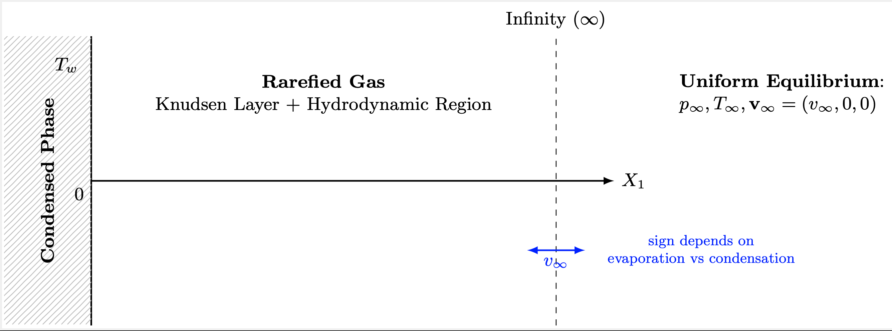

# `Plasma_BGK`: A BGK Kinetic Model for the study of Gas - Condensed-Phase Interaction

`Plasma_BGK` is a 1D Finite Volume solver for the Bhatnagar-Gross-Krook (BGK) kinetic equation. Developed at **Politecnico di Milano**, this project focuses on simulating rarefied gas dynamics, specifically targeting problems involving evaporation, condensation, and boundary layer discontinuities. The problem setting is the one described as:

<p align="center">
  
</p>

$$
\frac{\partial f}{\partial t} + \xi_1 \frac{\partial f}{\partial X_1} = A_c \rho (f^{(0)} - f)
$$

$$
f^{(0)} = \frac{\rho}{(2\pi R T)^{3/2}} \exp \left( -\frac{(\xi_1 - v_1)^2 + \xi_2^2 + \xi_3^2}{2RT} \right)
$$

Intially adressed with a finite difference method in [[1](#ref-1)] and [[2](#ref-2)]; here we propose a finite volume (Q.U.I.C.K.) approach integrated with the fast `Eigen` library. For a full theoretical description and implementation details please refer to the project report in the [`docs/`](docs/) folder.

## Table of Contents

- [Requirements](#requirements)
- [Installation](#installation)
- [Building the Project](#building-the-project)
- [Main Features](#main-features)
- [Usage & Examples](#usage--examples)
- [Project Structure](#project-structure)
- [Authors](#authors)

## Requirements

To build and run the C++ solver, you will need:

- **C++ Compiler**: A compiler supporting **C++20**.
- **Make**: GNU Make build system.
- [**Eigen3**](https://libeigen.gitlab.io): A template library for linear algebra.
- [**nlohmann/json**](https://github.com/nlohmann/json): A library for parsing JSON configuration files.
- [**OpenMP**](https://www.openmp.org): For parallel solver execution. (_Optional_)

To run the post-processing scripts, you will need **Python 3.x** and the following packages:

- `numpy`
- `matplotlib`
- `scipy` (optional, depending on specific analysis scripts)

If needed a virtual enviroment called `Bgk-venv` with all the necessary packages is provided in the projects's [**Google Drive Folder**](https://drive.google.com/drive/folders/14fjwMq2cQmRHNADEw7G7EoBn30CHxR80?usp=sharing)

## Installation

You can download the code by cloning the repository from GitHub:

```bash
git clone git@github.com:andrea-rella/Plasma_BGK.git
cd Plasma_BGK
```

## Building the Project

The project uses a standard `Makefile`. Before building, ensure the generic include paths in the Makefile match your system's library locations (specifically for Eigen and nlohmann-json).

To compile the executables:

```bash
make
```

To clean build artifacts:

```bash
make clean
```

To clean everything:

```bash
make distclean
```

## Main Features

- **Mathematical Model**: Solves the 1D BGK kinetic equation.
- **Numerical Method**: Finite Volume Method (FVM) for spatial discretization with specific support for velocity grid meshes (`SpaceMeshFV`, `VelocityMesh`).
- **Configuration**: Full simulation control via JSON input files (time steps, grid size, physical parameters, output settings).
- **Boundary Conditions**: Supports specific boundary conditions for evaporation/condensation problems and discontinuities.
- **Post-Processing**: Includes Python scripts (📁 [`postprocessing/`](postprocessing/)) for plotting density profiles, temperature, velocity, and comparing results with theoretical models (e.g., Ytrehus model).
- **Documentation**: Integrated Doxygen documentation support.

## Usage & Examples

In the following a brief and simple pipeline for running the solver is presented. For more details please refer to the documentation and the dedicated _"How to run the solver"_ in the project report (📁 [`docs/`](docs/)).

### 1. Configuration (JSON)

The simulation parameters need to be stored in a `.json` configuration file of the following format:

```json
{
  "mesh": {
    "space_points": 397, // Number of space points (N)
    "N0": 399, // Number of non unformed spaced points (N_0)
    "velocity_points": 60, // Number of half-velocity space points (\bar{N})
    "d1": 5e-4, // Space mesh spacing parameter
    "d2": 0.1, // Space mesh spacing parameter
    "a1": 1e-2, // Velocity mesh spacing parameter
    "a2": 2.5e-5 // Velocity mesh spacing parameter
  },

  "physical": {
    "T_infty_w": 1.0, // T_infty / T_w
    "p_infty_w": 17.0, // p_infty / p_w
    "M_infty": -1.2 // M_infty
  },

  "simulation": {
    "time_step": 0.05, // dt
    "tolerance": 1e-7, // relative tolerance
    "max_iterations": 1500, // maximum number of iterations
    "saving_every_k_steps": 50 // frequency of saving physical solution
  },

  "general": {
    "saving_folder_name": "./output/Cond/type1_data" // path where to save the output
  }
}
```

The configuration files used for the report are found in the [Google Drive Folder](https://drive.google.com/drive/folders/14fjwMq2cQmRHNADEw7G7EoBn30CHxR80?usp=sharing)

### 2. Running the Solver

The main executable requires a path to a valid JSON configuration file. Supposing a standard `main.cpp` like:

```cpp
    std::string configPath = ""; // default path
    configPath += std::string(argv[1]);

    Bgk::ConfigData<double> Data(configPath);
    Bgk::SolverFV<double> solver(Data);

    solver.initialize();

    solver.solve_parallel<Bgk::PlotStrategy::ONLYEND>(Bgk::metrics::VectorNormType::L2,
                                                      Bgk::metrics::RowAggregateType::Max);

    solver.write_all(Data.get_saving_folder_name());
```

**Basic Syntax:**

```bash
./main.exe <path_to_config_file>
```

**Example:**
To run a simulation using the data in `data/speed.json`:

```bash
./main.exe data/speed.json
```

### 3. Post-Processing

After the simulation finishes, results are stored in the folder specified in the JSON (e.g., `output/`). You can visualize them using the Python functions provided in the [`postprocessing/BGK_plot.py`](postprocessing/BGK_plot.py) file.

**Example**:

```bash
source <path_to_venv>/Bgk-venv/bin/activate
python -m postprocessing/my_plot.py
```

## Project Structure

- 📁 [`include/`](include/): Header files (`.hpp`) and template implementations (`impl/`).
- 📁 [`docs/`](docs/): Doxygen documentation configuration and output.
- 📁 [`postprocessing/`](postprocessing/): Python scripts for data analysis and plotting.

## Authors

- **Andrea Rella** - _Politecnico di Milano_

## References

<a id="ref-1"></a>[1] Aoki, Kazuo and Sone, Yoshio and Yamada, Tatsuo "Numerical analysis of gas flows condensing on its plane condensed phase on the basis of kinetic theory" Physics of Fluids A: Fluid Dynamics, 1990, American Institute of Physics.

<a id="ref-2"></a>[2] Sone, Yoshio and Sugimoto, Hiroshi "Strong evaporation from a plane condensed phase" Shinku, 1988, The Vacuum Society of Japan.
